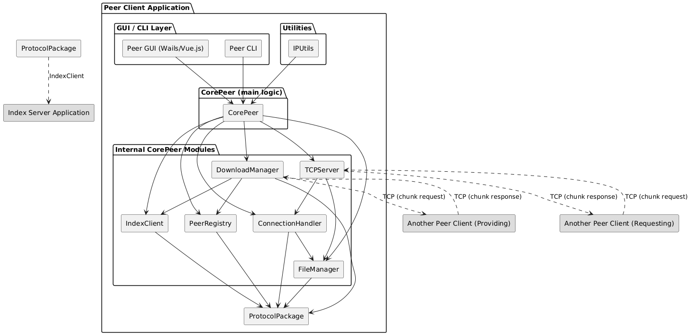
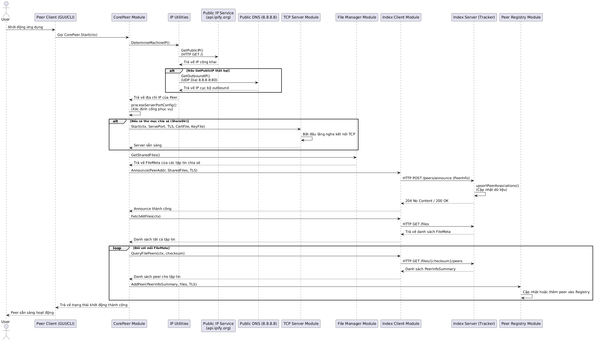
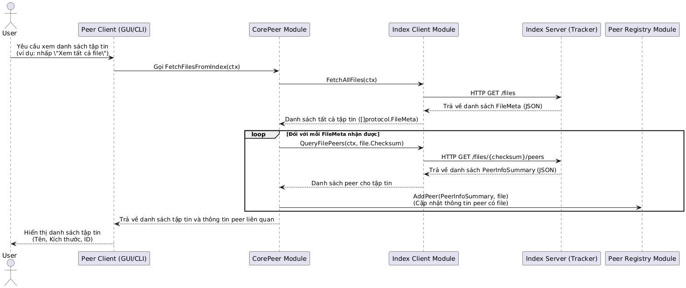
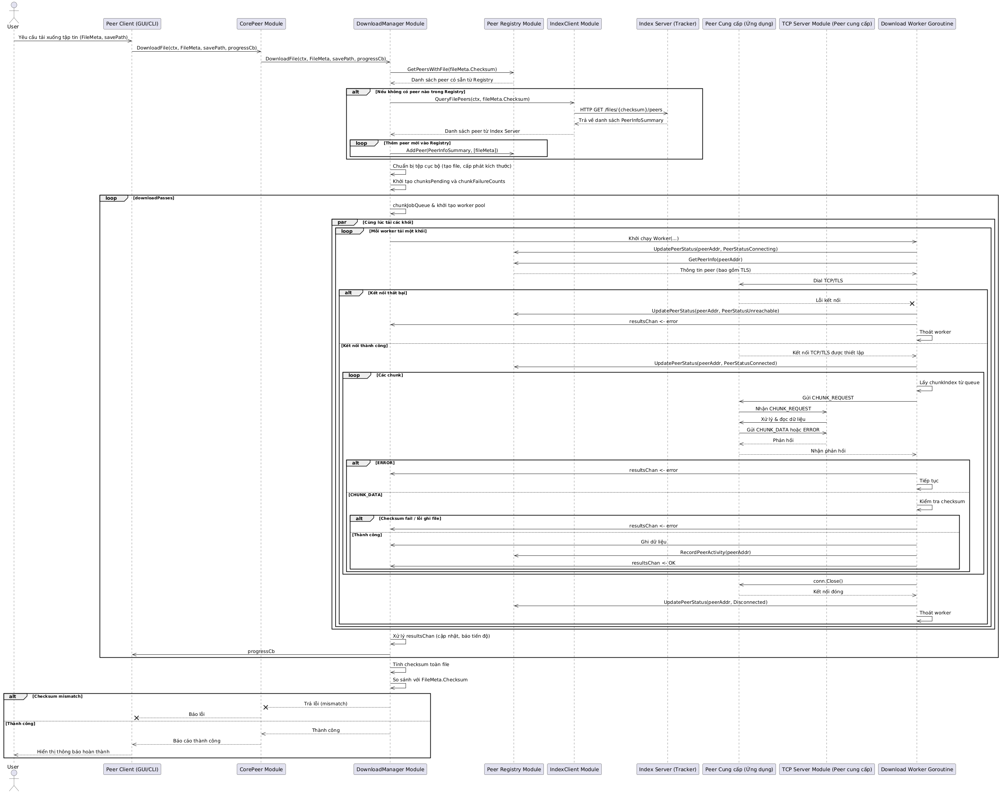
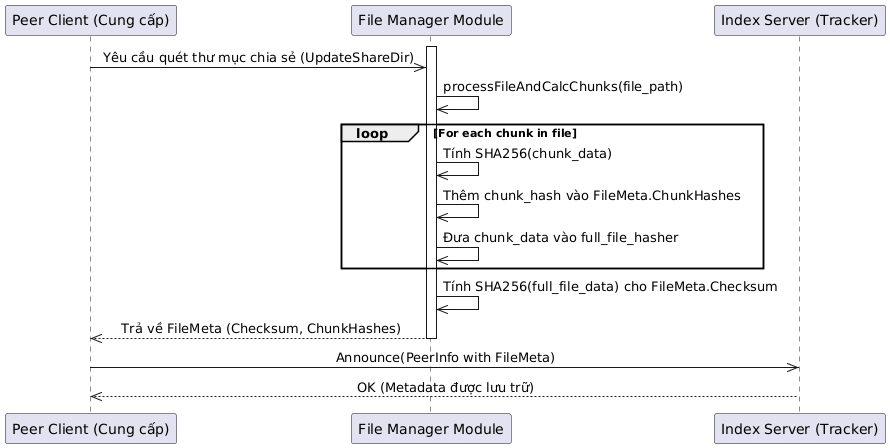
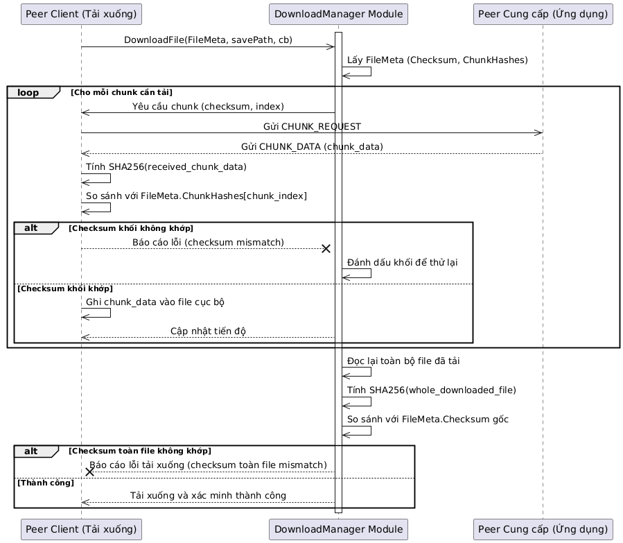

# Peer-to-Peer (P2P) File Sharing System

## Tổng quan

Hệ thống Chia sẻ Tập tin P2P được thiết kế với kiến trúc lai (hybrid), kết hợp giữa mô hình tập trung và phi tập trung. Hệ thống này **sử dụng một máy chủ HTTP trung tâm duy nhất đóng vai trò là index server** (hay còn gọi trong thuật ngữ BitTorrent là **tracker**). Máy chủ này chịu trách nhiệm đăng ký và hủy đăng ký tập tin, nơi các peer sẽ thông báo (announce) những tập tin mà họ đang chia sẻ cùng địa chỉ IP và cổng của họ. Ngoài ra, nó hỗ trợ khám phá peer bằng cách cung cấp danh sách các peer đang chia sẻ tập tin đó khi một peer muốn tìm kiếm hoặc tải một tập tin.

Sau giai đoạn **khám phá và bootstrap** này, các peer sẽ **thiết lập kết nối trực tiếp với nhau** thông qua socket TCP/UDP để trao đổi dữ liệu (tải lên và tải xuống tập tin). Điều này có nghĩa là quá trình truyền tải dữ liệu thực tế diễn ra hoàn toàn phi tập trung, tối ưu hóa hiệu suất và giảm tải cho máy chủ trung tâm.

Mỗi máy tính cá nhân chạy phần mềm này có thể đồng thời đóng vai trò là cả client (người tải xuống) và server (người cung cấp). Hệ thống sẽ giao tiếp trực tiếp với hệ điều hành để quản lý tập tin và sử dụng các API mạng để thiết lập kết nối và truyền dữ liệu.

## Yêu cầu

### Chức năng

Hệ thống sẽ thực hiện các chức năng chính sau:

- **[FUNC-01]** Quản lý kết nối Peer: Thiết lập và duy trì kết nối TCP/UDP với các peer khác trong mạng.
- **[FUNC-02]** Đăng ký/Hủy đăng ký tập tin chia sẻ: Cho phép người dùng chọn các tập tin/thư mục để chia sẻ và loại bỏ chúng khỏi danh sách chia sẻ.
- **[FUNC-03]** Tìm kiếm tập tin: Cho phép người dùng truy vấn danh sách các tập tin có sẵn trên mạng thông qua máy chủ index.
- **[FUNC-04]** Trả về tất cả các tập tin đang được chia sẻ: Với cài đặt hiện tại, chức năng này sẽ trả về tất cả các tập tin đang được chia sẻ trên máy chủ index, hiển thị các thông tin cơ bản bao gồm tên tập tin, kích thước và ID duy nhất (là SHA256 checksum của tập tin). Peer client hiện tại chưa sử dụng tính năng tìm kiếm theo từ khóa của endpoint HTTP server mà chỉ hiển thị toàn bộ danh sách này.
- **[FUNC-05]** Tải xuống tập tin: Yêu cầu và tải xuống tập tin từ một hoặc nhiều peer.
- **[FUNC-06]** Chia nhỏ tập tin: Tự động chia tập tin thành các khối nhỏ để tải xuống và truyền tải hiệu quả hơn.
- **[FUNC-07]** Tái tạo tập tin: Ghép các khối đã tải xuống để tạo lại tập tin gốc.
- **[FUNC-08]** Kiểm tra tính toàn vẹn dữ liệu: Sử dụng thuật toán băm (SHA-256) để xác minh rằng các khối dữ liệu và tập tin hoàn chỉnh không bị hỏng hoặc thay đổi trong quá trình truyền tải.
- **[FUNC-09]** Tải xuống từ nhiều nguồn (Swarm Download): Hỗ trợ tải các khối khác nhau của cùng một tập tin từ nhiều peer đồng thời.
- **[FUNC-10]** Cập nhật danh sách Peer: Tự động cập nhật danh sách các peer đang hoạt động và có thể truy cập được.
- **[FUNC-11]** Giao diện người dùng: Cung cấp giao diện đồ họa (GUI) đơn giản để người dùng tương tác trực tiếp với hệ thống (chia sẻ, tìm kiếm, tải xuống). Ngoài ra, một phiên bản giao diện dòng lệnh (CLI) rất đơn giản cũng được cung cấp, chủ yếu dùng cho mục đích kiểm thử và triển khai trên môi trường đám mây từ xa.

### Ràng buộc, giả định và phụ thuộc

Hệ thống sẽ được phát triển để hoạt động trên các hệ điều hành phổ biến **Windows và Linux**. Giao tiếp mạng sẽ sử dụng Socket TCP/UDP. Ngôn ngữ lập trình chính là **Go**, và giao diện người dùng sẽ được xây dựng bằng **Vue.js** thông qua framework **Wails**. Thuật toán băm sẽ được cố định là **SHA-256**, vì tuy [chậm hơn MD5](https://automationrhapsody.com/md5-sha-1-sha-256-sha-512-speed-performance/) nhưng với một phần mềm phụ thuộc cốt lõi vào chức năng kiểm chứng qua giá trị băm của dữ liệu, những [ưu thế SHA-256 đem lại so với MD5](https://itoolkit.co/blog/2023/08/why-is-sha256-more-reliable-than-md5-for-hashing/) là rất phù hợp.

Hệ thống phải tương thích với các phiên bản hiện tại của các giao thức mạng tiêu chuẩn được dùng (TCP/IP, IPv4, TCP, TLS, v.v.). Hệ thống hiện tại chưa được lên kế hoạch để đảm bảo xử lý ổn định giao thức IPv6. Về bảo mật, mặc dù SSL/TLS là tùy chọn và đang trong giai đoạn thử nghiệm, hệ thống cần xem xét các biện pháp bảo mật cơ bản để ngăn chặn truy cập độc hại đến điểm trung tâm duy nhất của hệ thống là index server. Tuy nhiên, với cài đặt hiện tại, hệ thống chưa được trang bị các cơ chế chống lại tấn công từ chối dịch vụ (DDoS).

Các yêu cầu về hiệu suất bao gồm việc tối ưu hóa tốc độ tải xuống, đặc biệt khi tải từ nhiều nguồn để tận dụng hiệu quả băng thông mạng khả dụng và đạt được tốc độ tải tốt hơn là tải từ một server tập trung. Thời gian truy xuất thông tin tập tin từ index server phải nhanh chóng, mục tiêu là dưới 1 giây trong điều kiện mạng ổn định. Cuối cùng, kiến trúc cần cho phép mở rộng để hỗ trợ số lượng peer và tập tin lớn hơn trong tương lai.

> [!NOTE]
>
> **Về việc lựa chọn ngôn ngữ Go thay vì C++**
>
> Mặc dù C++ được biết đến với khả năng kiểm soát phần cứng tốt và hiệu suất tối đa, việc lựa chọn Go cho dự án này được đưa ra dựa trên sự cân bằng giữa hiệu suất và năng suất phát triển. Các ưu điểm chính của Go so với C++ trong bối cảnh này bao gồm:
>
> - Go có tích hợp sẵn các goroutine và channels, giúp việc phát triển các ứng dụng mạng đồng thời trở nên đơn giản và an toàn hơn đáng kể so với việc quản lý luồng (threads) phức tạp trong các ngôn ngữ khác. Điều này đặc biệt quan trọng cho một hệ thống P2P đòi hỏi xử lý nhiều kết nối đồng thời.
> - Go tích hợp cơ chế garbage collection (GC), loại bỏ gánh nặng quản lý bộ nhớ thủ công mà C++ yêu cầu, giúp giảm thiểu lỗi rò rỉ bộ nhớ và tăng tốc độ phát triển. GC của Go được cài đặt để trong mọi trường hợp, GC pause (nguyên nhân chủ yếu về sự khác biệt về hiệu năng giữa các ngôn ngữ GC và các ngôn ngữ không GC) [luôn dưới 1ms](https://groups.google.com/g/golang-dev/c/Ab1sFeoZg_8).
> - Go có một thư viện chuẩn tích hợp tốt cho các tác vụ mạng (gói `net`, `http`), mã hóa (`crypto/sha256`, `crypto/tls`), và xử lý JSON, giảm thiểu sự phụ thuộc vào các thư viện bên ngoài phức tạp. Dự án này cũng chỉ sử dụng một thư viện bên ngoài duy nhất là Wails cho GUI frontend.
> - Ngôn ngữ Go có cú pháp đơn giản, dễ đọc và dễ học hơn so với C++, giúp tăng năng suất của đội ngũ phát triển.
>
> Mặc dù Go có thể có hiệu suất syscall và socket chậm hơn một chút (khoảng 1.4 lần, được mở rộng ở dưới phần [6. Các Khía cạnh Cải thiện](#6-các-khía-cạnh-cải-thiện)) so với C++ trong các trường hợp tệ nhất, và có thể yêu cầu tối ưu hóa cấp thấp cụ thể cho các hoạt động I/O cường độ cao, những nhược điểm này được đánh giá là nhỏ so với các lợi ích về năng suất, khả năng đồng thời và dễ dàng triển khai mà Go mang lại. Đối với một hệ thống chia sẻ tệp P2P, nơi tốc độ phát triển và quản lý các kết nối đồng thời là yếu tố then chốt, những ưu điểm của Go đối với dự án này được cho là hơn nhược điểm về hiệu suất.

Hệ thống và ứng dụng được thiết kế và cài đặt với giả định rằng người dùng cuối có kiến thức cơ bản về sử dụng máy tính và quản lý tập tin, không yêu cầu kiến thức chuyên sâu về mạng hay kỹ thuật P2P. Mục tiêu chính của họ là chia sẻ và tải xuống tập tin một cách nhanh chóng và an toàn, và họ mong muốn một giao diện trực quan, dễ sử dụng cho mục đích này. Hiện tại, không có vai trò quản trị viên đặc biệt nào được xác định trong phạm vi ban đầu của dự án, vì đây là một hệ thống phi tập trung ở cấp độ truyền tải dữ liệu.

Các giả định bao gồm việc người dùng có kiến thức cơ bản về sử dụng máy tính và quản lý tập tin, không yêu cầu kiến thức chuyên sâu về mạng hay kỹ thuật P2P; kết nối internet ổn định để tham gia mạng P2P, và các peer có đủ dung lượng ổ đĩa cứng để lưu trữ các tập tin đã tải xuống cũng như các tập tin chia sẻ. Việc cấu hình mạng như **mở port (port forwarding)** hoặc xử lý các vấn đề liên quan đến **NAT (Network Address Translation)** có thể cần thiết để các peer có thể kết nối trực tiếp với nhau. Tính toàn vẹn của dữ liệu dựa trên thuật toán băm SHA-256 được giả định là đủ để phát hiện các lỗi ngẫu nhiên hoặc thay đổi cố ý nhỏ trong dữ liệu trong quá trình truyền tải, đảm bảo dữ liệu được nhận là đúng với bản gốc.

Hệ thống phụ thuộc các thư viện chuẩn của ngôn ngữ lập trình Go để xử lý mạng và băm, và có thể tận dụng những đặc điểm của ngôn ngữ để rút ngắn thời gian phát triển phần mềm hoặc tối ưu hoá để đạt được hiệu năng tốt nhất. Hiệu suất tải file của hệ thống phụ thuộc vào băng thông mạng và năng lực xử lý của từng peer trong mạng.

## Kiến trúc

### Các thành phần chính

#### Index Server (Tracker)

Máy chủ Index (hay còn gọi là Tracker) đóng vai trò trung tâm trong kiến trúc lai của hệ thống. Chức năng chính của nó là duy trì một bộ chỉ mục (index) trong bộ nhớ về các tập tin đang được chia sẻ và thông tin của các peer hiện đang hoạt động trong mạng. Máy chủ này cho phép các peer khám phá lẫn nhau và các tập tin mà họ cung cấp, đóng vai trò là cơ chế bootstrap cho quá trình truyền tải tập tin phi tập trung. Nó quản lý quá trình thông báo (announce), hủy thông báo (de-announce) và tái thông báo (re-announce) từ các peer.

Các peer client tương tác với Index Server thông qua một tập hợp các API (endpoints) HTTP để đăng ký sự hiện diện của mình và truy vấn thông tin về các tập tin cũng như các peer khác. Các endpoint chính bao gồm:

- `GET /peers`: Trả về một danh sách tóm tắt tất cả các peer hiện đang được biết đến trong hệ thống.
- `GET /peers/{ip}/{port}/files`: Trả về danh sách các tập tin cụ thể mà một peer nhất định (được xác định bằng IP và cổng) đang chia sẻ.
- `POST /peers/announce`: Peer sử dụng endpoint này để đăng ký sự hiện diện của mình và danh sách các tập tin mà nó đang chia sẻ lên index server.
- `POST /peers/deannounce`: Peer gửi yêu cầu đến endpoint này khi nó muốn rút khỏi mạng hoặc ngừng chia sẻ các tập tin của mình.
- `POST /peers/reannounce`: Peer sử dụng endpoint này để cập nhật thông tin của mình và các tập tin chia sẻ, hoạt động như một sự kết hợp giữa hủy thông báo và thông báo lại.
- `GET /files`: Trả về metadata của tất cả các tập tin hiện đang được index server ghi nhận là đang được chia sẻ bởi ít nhất một peer.
- `GET /files/{checksum}`: Trả về metadata chi tiết của một tập tin cụ thể dựa trên SHA256 checksum của nó.
- `GET /files/{checksum}/peers`: Trả về danh sách các peer hiện đang chia sẻ một tập tin cụ thể (được xác định bằng SHA256 checksum).
- `GET /search/files?name=<query>`: Endpoint này cung cấp chức năng tìm kiếm sơ khai, cho phép truy vấn dựa trên tên tập tin hoặc checksum. Tuy nhiên, trong cài đặt hiện tại, peer client chỉ sử dụng /files để lấy toàn bộ danh sách tập tin chứ không sử dụng endpoint tìm kiếm này.

Index Server được triển khai bằng ngôn ngữ lập trình Go, sử dụng gói `net/http` thư viện chuẩn để cài đặt máy chủ HTTP. Dữ liệu về tập tin và peer được lưu trữ trong bộ nhớ (in-memory) dưới dạng các cấu trúc dữ liệu `map` Go, và được bảo vệ bằng một `sync.RWMutex` để đảm bảo an toàn truy cập đồng thời.

#### Peer Client

Peer Client là ứng dụng cốt lõi chạy trên máy tính của người dùng, đóng vai trò cả là người cung cấp và người tiêu thụ tập tin trong mạng P2P. Mã nguồn chính của Peer Client nằm trong package `corepeer`, được thiết kế để sử dụng chung cho cả giao diện đồ họa (GUI) và giao diện dòng lệnh (CLI). Nó quản lý các chức năng chính như chia sẻ tập tin, tải xuống, và tương tác với Index Server.

Cấu trúc chính của Peer Client được đại diện bởi struct `CorePeer` với các thành phần và chức năng quan trọng như sau:

- `CorePeerConfig`: Cấu hình cho Peer Client, bao gồm URL của Index Server, thư mục chia sẻ, cổng (port) phục vụ, cổng công khai, và các thiết lập TLS (chứng chỉ/khóa).
- `fileManager`: Chịu trách nhiệm quản lý các tập tin mà peer đang chia sẻ, bao gồm việc quét thư mục chia sẻ, tạo metadata tập tin (checksum, kích thước, chunk info) và cung cấp quyền truy cập vào các phần của tập tin.
- `peerRegistry`: Duy trì danh sách các peer đã kết nối hoặc được khám phá, cùng với thông tin về các tập tin mà chúng đang chia sẻ. Nó giúp theo dõi trạng thái và khả năng của các peer khác.
- `indexClient`: Module này xử lý tất cả các tương tác HTTP với Index Server, bao gồm việc gửi yêu cầu announce, de-announce, re-announce, cũng như lấy danh sách tập tin và peer từ index server.
- `downloadManager`: Điều phối quá trình tải xuống tập tin, bao gồm việc yêu cầu các phần (chunks) của tập tin từ nhiều peer khác nhau đồng thời (swarm download), quản lý tiến độ và xử lý các lỗi trong quá trình tải.
- `connectionHandler`: Xử lý các kết nối đến và đi từ các peer khác, quản lý giao tiếp cấp thấp để yêu cầu và cung cấp các khối dữ liệu.
- `tcpServer`: Thiết lập và quản lý máy chủ TCP cục bộ trên peer để lắng nghe các kết nối đến từ các peer khác, cho phép các peer khác tải xuống các tập tin được chia sẻ từ peer này. Nó cũng hỗ trợ TLS tùy chọn.

Các phương thức chính của CorePeer bao gồm:

- `Start(ctx context.Context)`: Khởi tạo và bắt đầu các dịch vụ của peer, bao gồm việc xác định địa chỉ IP, khởi động máy chủ TCP (nếu có thư mục chia sẻ), và thông báo sự hiện diện của peer cùng các tập tin chia sẻ lên Index Server.
- `Stop()`: Tạm dừng hoạt động của peer, bao gồm việc hủy thông báo khỏi Index Server và dừng máy chủ TCP.
- `Shutdown()`: Thực hiện tắt toàn bộ peer và các thành phần liên quan một cách triệt để, bao gồm cả Peer Registry.
- `UpdateConfig(ctx context.Context, newConfig CorePeerConfig)`: Cập nhật cấu hình của peer trong thời gian chạy, bao gồm thay đổi thư mục chia sẻ, cổng phục vụ, cổng công khai và URL của Index Server. Phương thức này cố gắng xử lý các thay đổi một cách an toàn nhưng lưu ý rằng một số thay đổi có thể yêu cầu khởi động lại peer để có hiệu lực hoàn toàn.
- Các phương thức khác như `GetSharedFiles`, `FetchFilesFromIndex`, `QueryPeersForFile`, `FetchFileFromIndex`, `DownloadFile`, và `GetConnectedPeers` cung cấp các API để tương tác với các chức năng cốt lõi của peer.

Peer Client được triển khai bằng ngôn ngữ lập trình Go cho phần logic backend. Phiên bản GUI sử dụng Wails để kết nối backend Go với giao diện người dùng frontend được xây dựng bằng Vue.js. Phiên bản CLI (dòng lệnh) được cài đặt và sử dụng trực tiếp package `corepeer` này, phục vụ chủ yếu cho mục đích kiểm thử (thủ công) và triển khai trên máy chủ từ xa.

> [!TIP]
>
> `sync.RWMutex` là một loại mutex (cơ chế khóa đồng bộ hoá) nâng cao trong Go, cho phép **nhiều goroutine đọc** dữ liệu cùng lúc nhưng **chỉ cho phép một goroutine duy nhất ghi** dữ liệu tại một thời điểm. Điều này khác biệt với `sync.Mutex` thông thường, vốn chỉ cho phép **một** goroutine duy nhất truy cập (đọc hoặc ghi) vào phần dữ liệu được bảo vệ tại bất kỳ thời điểm nào.
> Cơ chế này giúp tối ưu hoá hiệu năng của một phần mềm mà ở đó các thao tác đọc thường xảy ra và không có lý do gì để chặn toàn bộ goroutine chỉ để đọc, vì các thao tác đọc không làm ảnh hưởng, thay đổi đến dữ liệu quan trọng (critical section)

### Cấu trúc Module

Peer Client được thiết kế theo kiến trúc module hóa, với mỗi module (hay package trong Go) chịu trách nhiệm về một khía cạnh cụ thể của chức năng P2P. Module trung tâm là `CorePeer`, đóng vai trò điều phối, liên kết các module khác lại với nhau.

#### Các module chính và vai trò

`CorePeer` (trong package `corepeer`) là module trung tâm của Peer Client, nơi chứa logic điều phối cấp cao. Nó khởi tạo và quản lý vòng đời của các module con khác như `FileManager`, `IndexClient`, `PeerRegistry`, `DownloadManager`, `TCPServer`, và `ConnectionHandler`. `CorePeer` cung cấp các API công khai để ứng dụng GUI hoặc CLI tương tác, cho phép khởi động/dừng peer, cập nhật cấu hình, truy vấn thông tin file từ Index Server và bắt đầu tải xuống file.

`FileManager` (trong package `corepeer`, file `file_manager.go`) chịu trách nhiệm quản lý các tập tin cục bộ mà peer muốn chia sẻ. Chức năng chính của module này bao gồm quét thư mục chia sẻ, tạo metadata cho từng tập tin (như checksum tổng thể, kích thước và thông tin chia khối), đồng thời cung cấp quyền truy cập vào các phần dữ liệu của tệp khi một peer khác yêu cầu.

`IndexClient` (trong package `corepeer`, file `index_client.go`) chuyên trách về việc giao tiếp với máy chủ Index (Tracker). Nó xử lý các yêu cầu HTTP để thông báo (announce), hủy thông báo (de-announce) hoặc tái thông báo (re-announce) sự hiện diện của peer và các tập tin mà nó chia sẻ. Ngoài ra, module này còn thực hiện các truy vấn để lấy danh sách tất cả các tập tin đang được chia sẻ trên mạng và danh sách các peer đang cung cấp một tập tin cụ thể.

`PeerRegistry` (trong package `corepeer`, file `peer_registry.go`) duy trì một danh sách các peer đã biết trong mạng. Nó theo dõi trạng thái của từng peer, chẳng hạn như đang kết nối, bị ngắt kết nối hoặc không thể truy cập được, cùng với thời gian nhìn thấy gần nhất và các tập tin mà peer đó đang chia sẻ. `PeerRegistry` cũng có các vòng lặp nội bộ để dọn dẹp các kết nối cũ và xử lý các sự kiện liên quan đến trạng thái peer.

`DownloadManager` (trong package `corepeer`, file `download_manager.go`) là module cốt lõi của quá trình tải xuống. Nó điều phối việc tải các khối dữ liệu (chunks) của một tệp từ nhiều peer đồng thời (swarm download). `DownloadManager` quản lý hàng đợi công việc cho các khối, xử lý việc thử lại các khối bị lỗi, và cuối cùng lắp ráp lại các khối đã tải xuống thành tệp hoàn chỉnh, đồng thời kiểm tra tính toàn vẹn dữ liệu.

`TCPServer` (trong package `corepeer`, file `tcp_server.go`) thiết lập và quản lý máy chủ TCP cục bộ trên Peer Client. Mục đích của nó là lắng nghe và chấp nhận các kết nối đến từ các peer khác, cho phép các peer đó yêu cầu và tải xuống các khối dữ liệu từ peer hiện tại. Module này cũng hỗ trợ việc sử dụng TLS cho các kết nối an toàn.

`ConnectionHandler` (trong package `corepeer`, file `connection_handler.go`) làm việc chặt chẽ với `TCPServer`. Khi `TCPServer` chấp nhận một kết nối đến, `ConnectionHandler` sẽ tiếp quản để xử lý các yêu cầu từ peer đối tác. Nó diễn giải các loại yêu cầu (như `CHUNK_REQUEST`, Message ID 2), truy xuất dữ liệu từ `FileManager` và gửi trả lại các khối dữ liệu tương ứng.

`IPUtils` (trong package `corepeer`, file `ip_utils.go`) là một module tiện ích cung cấp các hàm để xác định địa chỉ IP của máy tính hiện tại, bao gồm cả việc cố gắng lấy địa chỉ IP công khai từ các dịch vụ bên ngoài và địa chỉ IP cục bộ.

`Protocol` (package `pkg/protocol`) là một package riêng biệt chứa các định nghĩa chung về cấu trúc dữ liệu (`FileMeta`, `PeerInfo`, `PeerInfoSummary`) và các loại thông điệp (`MessageType`) được sử dụng trong giao thức P2P nội bộ giữa các peer và khi giao tiếp với Index Server. Module này đóng vai trò cốt lõi, hầu hết tất cả các module đều tham chiếu đến package này, đảm bảo sự nhất quán trong định dạng dữ liệu và giao tiếp giữa các thành phần.

#### Mối quan hệ và tương tác giữa các module

Các module này tương tác một cách có tổ chức, với `CorePeer` đóng vai trò là lớp điều khiển chính. `CorePeer` khởi tạo và quản lý các instance của `FileManager`, `IndexClient`, `PeerRegistry`, `DownloadManager`, `ConnectionHandler`, và `TCPServer`. Cụ thể, `CorePeer` sử dụng `IPUtils` để tự định danh IP. Nó cũng sử dụng `FileManager` để quản lý tập tin chia sẻ và `IndexClient` để thông báo thông tin này lên Index Server.

Khi một peer muốn cung cấp file, `CorePeer` sẽ điều khiển `TCPServer` để bắt đầu hoặc dừng việc phục vụ tập tin. TCPServer lại dựa vào `ConnectionHandler` để xử lý từng kết nối đến, và `ConnectionHandler` sử dụng `FileManager` để truy xuất dữ liệu file cần gửi. Ngược lại, khi cần tải file, `CorePeer` ủy quyền cho `DownloadManager`. `DownloadManager` tương tác với `IndexClient` để tìm peer và với `PeerRegistry` để quản lý thông tin peer cũng như cập nhật trạng thái của chúng. `PeerRegistry` liên tục theo dõi trạng thái của các peer và có thể được cập nhật bởi cả IndexClient hoặc `DownloadManager` (khi một peer được tương tác thành công). Cuối cùng, tất cả các module liên quan đến dữ liệu dùng chung (`FileMeta`, `PeerInfo`, v.v.) đều phụ thuộc vào package `Protocol`, đảm bảo giao tiếp và cấu trúc dữ liệu thống nhất trong toàn bộ hệ thống.

Sơ đồ thành phần (Component Diagram) dưới đây minh họa cấu trúc module của Peer Client và mối quan hệ phụ thuộc giữa chúng:



### Một số luồng hoạt động quan trọng

#### Peer khởi động và thông báo sự hiện diện của mình cho index server.

Khi một Peer Client khởi động, nó thực hiện một chuỗi các bước để tự định danh trên mạng và đăng ký với Index Server. Mục tiêu là cho các peer khác biết về sự tồn tại và các tập tin mà peer này đang chia sẻ.

1. Peer Client bắt đầu bằng cách **xác định địa chỉ IP công khai** của mình. Nó ưu tiên sử dụng dịch vụ bên ngoài (https://api.ipify.org) để lấy địa chỉ IP công khai. Trong trường hợp không thể lấy được IP công khai (ví dụ, do lỗi mạng hoặc dịch vụ không khả dụng), nó sẽ **cố gắng lấy địa chỉ IP cục bộ** được sử dụng cho lưu lượng truy cập đi (outbound IP) thông qua việc kết nối tới một máy chủ DNS công cộng (ví dụ: `8.8.8.8:80`, dịch vụ DNS public của Google).
2. Dựa trên cấu hình, Peer Client sẽ **khởi động một socket TCP** (hay còn gọi là TCP server) để lắng nghe các kết nối đến từ các peer khác. Cổng phục vụ (serve port) có thể được cấu hình cố định hoặc được cấp phát ngẫu nhiên nếu được chỉ định là 0. Nếu thư mục chia sẻ (`ShareDir`) được cấu hình, máy chủ TCP sẽ được kích hoạt để sẵn sàng cung cấp các tập tin.
3. **Thông báo (Announce) lên Index Server:**
   1. Peer Client xây dựng một thông điệp Announce chứa địa chỉ IP và cổng mà nó sẽ công bố (có thể là cổng phục vụ hoặc cổng công khai được cấu hình riêng), cùng với metadata của tất cả các tập tin mà nó đang chia sẻ (bao gồm checksum, tên, kích thước, và thông tin chunk).
   2. Thông điệp này được gửi dưới dạng yêu cầu HTTP POST tới endpoint `/peers/announce` của Index Server.
   3. Index Server nhận yêu cầu này, cập nhật cơ sở dữ liệu (in-memory `map`) của nó để ghi nhận sự hiện diện của peer và các tập tin mà peer này chia sẻ. Index Server cũng đảm bảo rằng các thông tin cũ của peer này (nếu có) được cập nhật hoặc loại bỏ để tránh dữ liệu trùng lặp hoặc lỗi thời.
4. Sau khi thông báo thành công, Peer Client **truy vấn Index Server để lấy danh sách các peer khác** và các tập tin mà chúng đang chia sẻ.
   1. Nó gửi yêu cầu HTTP GET tới endpoint `/files` để lấy metadata của tất cả các tập tin đang được chia sẻ trên mạng.
   2. Với mỗi tập tin, nó tiếp tục gửi yêu cầu HTTP GET tới endpoint `/files/{checksum}/peers` để lấy danh sách các peer cụ thể đang chia sẻ tập tin đó.
   3. Thông tin này sau đó được sử dụng để cập nhật Peer Registry cục bộ của peer, giúp nó biết được các peer khác trong mạng và các tập tin sẵn có để tải xuống. Peer sẽ không thêm chính nó vào danh sách này.



#### Người dùng tìm kiếm và truy xuất thông tin tập tin từ Index Server

Khi người dùng muốn tìm kiếm hoặc xem các tập tin có sẵn trong mạng, ứng dụng Peer Client sẽ tương tác với Index Server để lấy thông tin. Hiện tại, cơ chế tìm kiếm này tập trung vào việc hiển thị tất cả các tập tin đang được chia sẻ thay vì tìm kiếm theo từ khóa cụ thể.

1. **Người dùng tương tác với giao diện** của Peer Client (GUI hoặc CLI) để xem danh sách các tập tin có thể tải xuống. Đây có thể là một thao tác nhấp nút hoặc gõ lệnh.
2. **Peer Client sử dụng `IndexClient`** để **gửi một yêu cầu** HTTP GET tới endpoint `/files` của Index Server. Mục tiêu là lấy toàn bộ danh sách các metadata của tập tin mà Index Server hiện đang theo dõi.
3. Index Server xử lý yêu cầu và **trả về một danh sách các đối tượng `FileMeta` dưới dạng JSON**. Mỗi đối tượng `FileMeta` bao gồm checksum (ID duy nhất), tên tập tin và kích thước.
4. Peer Client nhận phản hồi từ Index Server, **giải mã dữ liệu JSON** thành các đối tượng `FileMeta` tương ứng.
5. Sau khi có danh sách các tập tin, Peer Client tiếp tục truy vấn Index Server bằng endpoint `/files/{checksum}/peers` cho từng tập tin để **lấy danh sách các peer cụ thể đang chia sẻ tập tin đó**. Thông tin này được sử dụng để cập nhật `PeerRegistry` nội bộ, giúp Peer Client biết được nguồn gốc của các tập tin và duy trì một bản đồ các peer có sẵn.
6. Cuối cùng, Peer Client **hiển thị danh sách các tập tin** đã truy xuất được trên giao diện người dùng (GUI hoặc CLI), bao gồm tên tập tin, kích thước và checksum. Người dùng có thể chọn một tập tin từ danh sách này để bắt đầu quá trình tải xuống.



#### Peer Client yêu cầu và tải dữ liệu trực tiếp từ các peer khác

Quá trình tải xuống tập tin là một trong những chức năng cốt lõi và phức tạp nhất của Peer Client, được quản lý bởi `DownloadManager`. Nó bao gồm việc phân chia tập tin thành các khối nhỏ, tải xuống song song từ nhiều nguồn, và đảm bảo tính toàn vẹn của dữ liệu.

1. Người dùng **chọn một tập tin từ danh sách** các tập tin có sẵn và bắt đầu tải xuống. Yêu cầu này được chuyển đến `CorePeer`, sau đó đến `DownloadManager`.
2. DownloadManager đầu tiên kiểm tra PeerRegistry cục bộ để **tìm các peer đang chia sẻ tập tin mong muốn**. Nếu không tìm thấy trong registry, nó sẽ truy vấn `IndexServer` (`IndexClient.QueryFilePeers`) để lấy danh sách các peer có sẵn. Nếu không có peer nào, quá trình tải xuống sẽ dừng lại. Các peer mới được phát hiện từ Index Server sẽ được thêm vào `PeerRegistry`.
3. Một **tệp mới được tạo trên máy** tại `savePath` được chỉ định. Kích thước của tệp sẽ được cấp phát trước (pre-allocate) để khớp với `fileMeta.Size` của tệp đích. Nếu tệp rỗng (kích thước 0), nó sẽ được tạo và kiểm tra checksum ngay lập tức vì không có dữ liệu gì để tải.
4. **Quản lý khối (Chunk Management):**
   1. Tập tin được chia thành các khối (chunks) có kích thước cố định (`CHUNK_SIZE`, mặc định 1MB).
   2. Một danh sách `chunksPending` được tạo để theo dõi tất cả các khối cần được tải xuống.
   3. Một `map` `chunkFailureCounts` ghi lại số lần tải xuống thất bại của mỗi khối, phục vụ cho cơ chế thử lại.
5. DownloadManager **điều phối tải xuống** song song (Swarm Download) theo nhiều lượt (download passes) cho đến khi tất cả các khối được tải về thành công hoặc đạt đến số lượt thử lại tối đa.
   1. Các khối còn lại trong `chunksPending` được đưa vào một kênh (channel) `chunkJobQueue`. Nhiều goroutine (worker) được khởi tạo để xử lý các công việc này. Số lượng worker được giới hạn bởi `MAX_CONCURRENT_DOWNLOADS_PER_FILE` và số lượng peer có sẵn.
   2. Mỗi worker sẽ chọn một peer từ danh sách các peer có sẵn (đã được xáo trộn ngẫu nhiên để phân tán tải). Worker sẽ cố gắng thiết lập một kết nối TCP (hoặc TLS nếu `peer.TLS` là `true` và cấu hình TLS của peer hiện tại cho phép).
   3. Sau khi kết nối thành công, worker gửi một yêu cầu `CHUNK_REQUEST` tới peer cung cấp. Yêu cầu này bao gồm `fileMeta.Checksum` và `chunkIndex` cần tải.
   4. Peer cung cấp sẽ phản hồi bằng một thông điệp `CHUNK_DATA` chứa dữ liệu của khối được yêu cầu, hoặc một thông điệp `ERROR` nếu có vấn đề.
   5. Dữ liệu khối nhận được sẽ được tính toán SHA256 checksum và so sánh với `fileMeta.ChunkHashes[chunkIndex]`. Nếu checksum không khớp hoặc có lỗi truyền tải/ghi tệp, khối đó sẽ được đánh dấu để thử lại và `chunkFailureCounts` sẽ tăng lên.
   6. Nếu khối dữ liệu hợp lệ và checksum khớp, nó sẽ được ghi vào vị trí chính xác trong tệp đích (`file.WriteAt`).
   7. Sau mỗi khối được xử lý thành công, `progressCb` (một hàm callback được truyền đến từ frontend phục vụ progress reporting) sẽ được gọi để cập nhật tiến độ tải xuống cho giao diện người dùng. Đồng thời, `PeerRegistry.RecordPeerActivity` được gọi để cập nhật thời gian "nhìn thấy gần nhất" của peer cung cấp, giúp ngăn chặn peer bị đánh dấu là không hoạt động (idle) hoặc không kết nối được (unreachable) và bị xoá khỏi Peer Registry. Khối đã hoàn thành sẽ được loại bỏ khỏi `chunksPending`.
6. **Xử lý lỗi và thử lại:**
   1. Nếu một khối thất bại khi tải xuống (do lỗi kết nối, checksum không khớp, lỗi ghi tệp, hoặc peer trả về `ERROR`), `chunkFailureCounts` cho khối đó sẽ tăng lên.
   2. Nếu `chunkFailureCounts` của một khối đạt `MAX_RETRIES_PER_CHUNK`, khối đó sẽ bị bỏ qua và không được thử lại nữa trong các lượt tải xuống tiếp theo.
   3. Nếu context tải xuống bị hủy (`ctx.Done()`), quá trình tải xuống sẽ dừng lại.
7. Sau khi tất cả các khối được tải xuống thành công (hoặc đạt số lần thử lại tối đa), `DownloadManager` sẽ **tính toán SHA256 checksum của toàn bộ tệp đã tải xuống** và so sánh với `fileMeta.Checksum` gốc. Nếu hai checksum khớp nhau, tệp được xác minh là đã tải xuống hoàn chỉnh và chính xác. Ngược lại, lỗi checksum toàn tệp sẽ được báo cáo.



#### Kiểm tra tính toàn vẹn dữ liệu

Hệ thống sử dụng thuật toán băm SHA-256 để đảm bảo tính toàn vẹn của dữ liệu trong suốt quá trình chia sẻ và tải xuống. Cơ chế kiểm tra này được thực hiện ở cả cấp độ tệp và cấp độ khối (chunk).

Có 2 luồng hoạt động mà việc kiểm tra tính toàn vẹn này được thực hiện:

**Trong quá trình chia sẻ tệp (khi quét thư mục chia sẻ):**

1. Khi một peer bắt đầu chia sẻ một thư mục, `FileManager` sẽ quét tất cả các tệp trong thư mục đó.
2. Đối với mỗi tệp, hàm `processFileAndCalcChunks` sẽ được gọi. Hàm này **thực hiện một lần đọc toàn bộ tệp và thực hiện hai tác vụ băm song song:**
   1. Một bộ băm SHA-256 duy nhất (`fullFileHasher`) được sử dụng để **băm toàn bộ tệp** khi nó được đọc qua. Checksum cuối cùng này (`FileMeta.Checksum`) sẽ đại diện cho tính toàn vẹn của toàn bộ tệp.
   2. Tệp được chia thành các khối có kích thước cố định (mặc định 1MB). **Đối với mỗi khối, một bộ băm SHA-256 riêng biệt được sử dụng** để tính toán checksum của khối đó. Các checksum này được lưu trữ trong một mảng (`FileMeta.ChunkHashes`).
3. Metadata của tệp, bao gồm checksum tổng thể và mảng checksum của từng khối, sau đó được gửi lên Index Server thông qua quá trình Announce, và cũng được lưu trữ cục bộ trong `FileManager`.



**Trong quá trình tải xuống tệp:**

1. Khi `DownloadManager` nhận được một yêu cầu tải xuống tệp, nó sử dụng `FileMeta` của tệp đích, bao gồm `FileMeta.Checksum` và `FileMeta.ChunkHashes` đã được cung cấp từ Index Server.
2. **Kiểm tra tính toàn vẹn của từng khối (chunk):**
   1. Khi một worker trong `DownloadManager` nhận được dữ liệu của một khối từ peer cung cấp, nó sẽ ngay lập tức tính toán SHA-256 checksum của khối dữ liệu vừa nhận được.
   2. Checksum này sau đó được so sánh với checksum tương ứng trong `FileMeta.ChunkHashes` của tệp.
   3. Nếu hai checksum này không khớp, khối đó được coi là bị lỗi (hỏng hoặc bị thay đổi trong quá trình truyền tải) và sẽ được đánh dấu để thử lại (nếu chưa đạt số lần thử lại tối đa). Dữ liệu lỗi sẽ không được ghi vào tệp đích.
3. **Kiểm tra tính toàn vẹn của toàn bộ tệp sau khi tải xuống hoàn chỉnh:**
   1. Sau khi tất cả các khối đã được tải xuống và ghi vào tệp đích (hoặc đã đạt số lần thử lại tối đa cho các khối lỗi), DownloadManager sẽ đọc lại toàn bộ tệp đã được xây dựng từ các khối.
   2. Một checksum SHA-256 tổng thể mới được tính toán cho tệp này.
   3. Checksum vừa tính toán được so sánh với FileMeta.Checksum gốc của tệp được cung cấp bởi Index Server.
   4. Nếu hai checksum này khớp nhau, tệp được xác nhận là đã tải xuống hoàn chỉnh và chính xác. Nếu không khớp, một lỗi checksum tổng thể sẽ được báo cáo, cho thấy tệp đã bị hỏng hoặc thay đổi trong quá trình tải.



## Cài đặt và chạy

### Yêu cầu Hệ thống

Để cài đặt và chạy hệ thống Chia sẻ Tập tin P2P, máy tính cần được đảm bảo đáp ứng các yêu cầu tối thiểu về cả phần cứng và phần mềm.

Về phần cứng:

Hệ thống yêu cầu một CPU cơ bản, đủ RAM để chạy ứng dụng (khoảng 500 MB), và đủ dung lượng ổ đĩa trống để lưu trữ các tập tin bạn muốn chia sẻ cũng như các tập tin tải xuống. Kết nối mạng ổn định với Internet là bắt buộc để có thể truy cập Index Server và kết nối với các peer khác.

Về phần mềm:

Hệ thống được thiết kế để chạy trên các hệ điều hành phổ biến như Windows và Linux. Các thành phần phần mềm cần thiết bao gồm:

- **Go Runtime và Toolchain:** Phiên bản Go 1.24.4 hoặc mới hơn là cần thiết để biên dịch và chạy các thành phần backend.
  - ** Wails CLI:** Công cụ dòng lệnh Wails phiên bản 2.x để xây dựng ứng dụng GUI (sử dụng Vue.js frontend và Go backend).
- **Node.js và pnpm:** Môi trường Node.js và trình quản lý gói pnpm cần thiết để xây dựng phần frontend Vue.js.
- **Các gói thư viện hệ thống:** Các gói phát triển và thư viện như (nếu ở Linux họ Debian, Ubuntu dùng `apt`) git, build-essential (bao gồm gcc và make), libgtk-3-dev, libwebkit2gtk-4.0-dev, npm, pkg-config, docker.io, nsis là bắt buộc để biên dịch và chạy ứng dụng.

### Hướng dẫn Cài đặt

Phần này cung cấp các bước chi tiết để có thể cài đặt và chạy ứng dụng trên môi trường máy ảo (VM) trên các nền tảng đám mây (EC2 của AWS, Compute Engine của Google Cloud Platform, Virtual Machine của Azure, v.v.), hoặc tương tự trên các hệ thống Linux.

Tài liệu hiện chưa có hướng dẫn chi tiết cài đặt trên Windows.

#### Cấu trúc Thư mục Dự án

- cmd/: Chứa các điểm vào (entry points) chính của ứng dụng.
  - cmd/index-server/main.go: Mã nguồn cho Index Server (Tracker).
  - cmd/peer/main.go: Mã nguồn cho phiên bản Peer Client CLI.
- dist/: Thư mục chứa các tệp nhị phân (binaries) đã được biên dịch và các gói phân phối cho các ứng dụng.
  - dist/index-server-cli: Chứa bản biên dịch của Index Server CLI.
  - dist/peer: Chứa bản biên dịch của Peer Client GUI (do Wails tạo ra).
  - dist/peer-cli: Chứa bản biên dịch của Peer Client CLI.
- gui/peer/: Chứa mã nguồn cho ứng dụng Peer Client GUI.
  - app.go: Phần backend Go của ứng dụng GUI, giao tiếp với corepeer.
  - frontend/: Chứa mã nguồn frontend Vue.js.
  - wailsjs/: Các tệp được Wails tạo ra để kết nối Go backend và Vue.js frontend.
- pkg/: Chứa các package Go dùng chung và logic cốt lõi.
  - pkg/corepeer/: Chứa mã nguồn chính của CorePeer, cung cấp các chức năng cốt lõi cho cả GUI và CLI.
  - pkg/protocol/: Định nghĩa các cấu trúc dữ liệu và loại tin nhắn (message types) cho giao thức P2P nội bộ và giao tiếp với Index Server.

#### Các bước cài đặt chung

Trước tiên, cài đặt các công cụ và môi trường cần thiết:

```sh
# Cài đặt pnpm
curl -fsSL https://get.pnpm.io/install.sh | sh -
# Cài đặt Go: tải xuống và giải nén Go runtime. Thay đổi phiên bản nếu cần thiết.
wget https://go.dev/dl/go1.24.4.linux-amd64.tar.gz
sudo tar -C /usr/local -xzf go1.24.4.linux-amd64.tar.gz
# Sau khi giải nén, thêm Go vào biến môi trường PATH của hệ thống.
# Mở tệp ~/.bashrc (hoặc ~/.zshrc nếu dùng Zsh) bằng trình soạn thảo văn bản (ví dụ vim) và thêm các dòng sau vào cuối tệp:
export PATH=/usr/local/go/bin:${PATH}
export PATH=~/go/bin:${PATH}
# Sau đó, áp dụng các thay đổi bằng lệnh:
source ~/.bashrc
# Cài đặt Wails
go install github.com/wailsapp/wails/v2/cmd/wails@latest
# Cài đặt các gói hệ thống cần thiết
sudo apt install git build-essential nodejs libgtk-3-dev libwebkit2gtk-4.0-dev npm pkg-config docker.io nsis

# Clone mã nguồn và biên dịch
git clone https://github.com/cdf144/p2p-file-sharing.git ~/p2p-file-sharing
cd ~/p2p-file-sharing && ./scripts/build_all.sh
# Các tệp thực thi sẽ được tạo trong thư mục dist/.
# Để chạy Index Server (chỉnh -port tuỳ ý):
./dist/index-server-cli -port 9090
# Để chạy Peer Client, chỉ định thư mục chia sẻ, cổng phục vụ cục bộ, và URL của Index Server.
# Thay <host> bằng địa chỉ IP hoặc tên miền của máy chủ Index Server (ví dụ: http://<Index_Server_IP_Address>:9090).
# Nếu thư mục ~/share chưa tồn tại, hãy tạo nó trước khi chạy lệnh này.
./dist/peer-cli -shareDir ~/share -servePort 9091 -indexURL http://<host>:9090 start
```

Để các peer có thể kết nối trực tiếp với nhau, cần **cấu hình mạng** để đảm bảo các peer kết nối được với máy tính. Điều này bao gồm việc mở port (port forwarding) trên router hoặc cấu hình tường lửa (firewall) để cho phép lưu lượng truy cập đến các cổng mà Peer Client sử dụng (servePort và publicPort nếu có). Các vấn đề liên quan đến NAT (Network Address Translation) cũng có thể cần được xem xét để đảm bảo khả năng kết nối giữa các peer nằm sau các NAT khác nhau.

## Kiểm thử và CI/CD

### Phương pháp và loại kiểm thử

Về các loại kiểm thử, phần lớn quá trình kiểm thử sẽ là **kiểm thử thủ công các yêu cầu chức năng**. Điều này là do các ràng buộc về thời gian và công sức đáng kể cần thiết cho việc xây dựng các kịch bản kiểm thử tích hợp (integration testing) hoặc kiểm thử đầu cuối (end-to-end testing) tự động trong một hệ thống có những sự phụ thuộc module và luồng xử lý tương đối phức tạp như thế này. Mặc dù vậy, **kiểm thử đơn vị (Unit Testing)** có thể được triển khai và thực hiện hiệu quả cho một số hàm và module riêng lẻ, đặc biệt là những phần cốt lõi và độc lập.

Cụ thể, dự án hiện có một tệp kiểm thử đơn vị (`file_manager_test.go`) tập trung vào việc kiểm tra tính toán checksum cho các tệp và các khối (chunks) trong module `FileManager`. Tệp kiểm thử này bao gồm nhiều trường hợp thử nghiệm tổng hợp (`TestProcessFileAndCalcChunksSynthetic`) với các kích thước tệp khác nhau (từ tệp rỗng đến nhiều MB) để đảm bảo tính đúng đắn của thuật toán băm SHA-256 ở cả cấp độ tệp và cấp độ khối. Nó cũng có các bài kiểm tra về các trường hợp lỗi (`TestProcessFileAndCalcChunksErrorCases`) và test về hiệu suất (`BenchmarkProcessFileAndCalcChunks`).

Điểm đặc biệt của kiểm thử này là sự kết hợp với một script bash hỗ trợ [`scripts/validate_chunks.sh`](scripts/validate_chunks.sh) trong bài kiểm thử `TestProcessFileAndCalcChunksWithBashValidation`. Script này tính toán độc lập checksum của toàn bộ tệp và từng khối của tệp trên môi trường Linux bằng các công cụ chuẩn `dd` và `sha256sum`. Bằng cách so sánh kết quả băm từ mã Go của hệ thống với kết quả từ script bash này, ta có thể xác minh chéo tính chính xác của logic băm, đóng vai trò như một dạng kiểm thử tích hợp nhẹ cho chức năng cốt lõi này.

Ngoài ra, trong tương lai, có các hàm khác phù hợp để viết kiểm thử đơn vị nếu có điều kiện:

- Trong `FileManager` (file `file_manager.go`):
  - Các hàm truy vấn như `GetFilePathByChecksum`, `GetFileMetaByChecksum`, và `GetLocalFileInfoByChecksum`: Đảm bảo chúng trả về thông tin chính xác và xử lý trường hợp không tìm thấy tệp đúng cách.
  - Hàm `scanDirectory`: Xác minh khả năng quét đúng các tệp trong thư mục và gọi processFileAndCalcChunks cho từng tệp hợp lệ.
- Trong `DownloadManager` (file `download_manager.go`):
  - Logic xử lý hàng đợi công việc của các khối và phân phối chúng cho các worker trong `DownloadFile`.
  - Xử lý lỗi và cơ chế thử lại của từng khối (`chunkFailureCounts`).
  - Các thành phần của `runPeerDownloadSession` có thể được kiểm thử độc lập, chẳng hạn như khả năng gửi yêu cầu `CHUNK_REQUEST` và phân tích cú pháp phản hồi `CHUNK_DATA` hoặc `ERROR` từ peer (sử dụng các mock hoặc stub cho kết nối mạng).
- Trong `pkg/protocol`:
  - Hàm `GenerateChecksum`: Kiểm tra tính toán checksum cho các byte đầu vào khác nhau.

**Kiểm thử tích hợp** có thể sẽ được thực hiện ở mức độ hạn chế, chủ yếu tập trung vào việc xác nhận sự tương tác cơ bản giữa các module chính, ví dụ như Peer Client có thể kết nối với Index Server và gửi/nhận thông báo thành công.

**Kiểm thử hệ thống** sẽ chủ yếu là kiểm thử chức năng thủ công. Điều này bao gồm việc thiết lập nhiều Peer Client và một Index Server với hỗ trợ của các nền tảng Cloud Computing như Virtual Machine của Azure, sau đó thực hiện các luồng công việc của người dùng như chia sẻ tệp, tìm kiếm tệp, và tải tệp từ nhiều peer để đảm bảo toàn bộ hệ thống hoạt động như mong đợi.

### Quy Trình Tích Hợp Liên Tục / Triển Khai Liên Tục (CI/CD)

Dự án này được trang bị một quy trình CI/CD tự động, được định nghĩa trong tệp cấu hình GitHub Actions ([`.github/workflows/ci.yml`](.github/workflows/ci.yml)). Quy trình này đảm bảo rằng mỗi thay đổi mã nguồn đều được kiểm tra, phân tích, và biên dịch một cách nhất quán.

Quy trình CI/CD được kích hoạt khi có các sự kiện đẩy mã nguồn (push) lên các nhánh main và develop, hoặc khi có yêu cầu pull request vào nhánh main. Quy trình bao gồm các job chính sau:

**Run Tests (`test` job):**

- Đảm bảo tất cả các bài kiểm thử đơn vị (unit tests) của Go đều vượt qua.
- Các bước chính gồm Kiểm tra mã nguồn, thiết lập môi trường Go, tải và xác minh các phụ thuộc Go. Sau đó, nó chạy các bài kiểm thử Go với cờ `-race` (phát hiện race conditions) và `-coverprofile` (tạo báo cáo độ bao phủ mã). Các kết quả kiểm thử và báo cáo độ bao phủ được tải lên dưới dạng artifact.
- Lệnh liên quan: `go test -v -race -coverprofile=coverage.out -covermode=atomic ./...` và `go tool cover -html=coverage.out -o coverage.html`.

**Lint Code (`lint` job):**

- Phân tích mã nguồn để phát hiện các lỗi lập trình, vấn đề về phong cách code (code style), và các vi phạm quy tắc mã hóa.
- Tương tự như `test` job, job này thiết lập môi trường và sau đó sử dụng `golangci-lint` qua công cụ `golangci-lint-action` để thực hiện phân tích tĩnh mã nguồn Go.

**Build Applications (build job):**

- Biên dịch các ứng dụng Peer Client CLI và Index Server, và Peer Client GUI cho các nền tảng khác nhau.
- Job này chạy song song trên các hệ điều hành (`ubuntu-latest`, `windows-latest`, `macos-latest`) và kiến trúc mục tiêu (target architecture) (`linux/amd64`, `windows/amd64`, `darwin/universal`). Job này cài đặt Go, Node.js, pnpm, Wails CLI và các phụ thuộc frontend, sau đó biên dịch các phiên bản CLI bằng `go build` và ứng dụng GUI bằng `wails build`. Các tệp nhị phân được tạo ra sẽ được tải lên dưới dạng artifact.

**Security Scan (security job):**

- Quét các phụ thuộc của dự án để phát hiện các lỗ hổng bảo mật đã biết.
- Các bước chính gồm Cài đặt công cụ quét lỗ hổng Nancy và sau đó chạy nó trên danh sách các phụ thuộc Go của dự án.

**Create Release (release job):**

- Tự động tạo bản phát hành (release) trên GitHub khi một thẻ (tag) phiên bản mới được đẩy lên.
- Job này phụ thuộc vào sự hoàn thành thành công (return code `0`) của các job `test`, `lint`, và `build`. Nó tải xuống tất cả các artifact (tệp nhị phân) từ các job `build` và sau đó sử dụng `softprops/action-gh-release` để tạo một bản phát hành mới trên GitHub, đính kèm các tệp nhị phân đã biên dịch.

## Tài liệu tham khảo

- Mô tả Dự án ban đầu (VDT 2025 - Software Engineering)
- **Giao thức mạng:**
  - RFC 793 (Transmission Control Protocol)
  - RFC 768 (User Datagram Protocol)
  - BitTorrent Protocol Specification (tham khảo các phần cơ bản): https://wiki.theory.org/BitTorrentSpecification
- **Ngôn ngữ lập trình Go:**
  - `net` package documentation (bao gồm `net/netip`) : https://pkg.go.dev/net
  - `http` package documentation: https://pkg.go.dev/http
  - `json` package documentation: https://pkg.go.dev/json
  - `sync` package documentation: https://pkg.go.dev/sync
  - `context` package documentation: https://pkg.go.dev/context
  - `crypto` package documentation (điển hình `crypto/sha256`, `crypto/tls`): https://pkg.go.dev/crypto
  - `io` package documentation: https://pkg.go.dev/io
  - `encoding` package documentation (điển hình `encoding/hex`, `encoding/json`): https://pkg.go.dev/encoding
  - Explaining the Golang I/O multiplexing netpoller model: https://www.sobyte.net/post/2022-01/go-netpoller/
- **Thuật toán băm:**
  - FIPS PUB 180-4 (Secure Hash Standard - SHA-256)
  - RFC 1321 (MD5 Message-Digest Algorithm)
- **Phát triển ứng dụng BitTorrent:**
  - Bài viết "Building a BitTorrent client from the ground up in Go" bởi Jesse Li: https://blog.jse.li/posts/torrent/
- **Framework phát triển giao diện người dùng:**
  - Wails Documentation (Go): https://wails.io/docs/
  - Vue.js Documentation: https://vuejs.org/guide/
